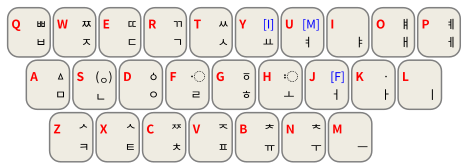

# Rime古谚文输入方案

## 简介

这是一个基于[Rime](https://rime.im/)的古谚文输入方案。可以以形码的方式，方便地输入古谚文字符和傍点。用户还可以根据喜好，对输出字符进行四种模式的调整。

## 特性

- 四种可选的输出模式

  由于古谚文基本是由Hangul Jamo及其扩展区字符以初声（초성, Choseong）、中声（중성, Jungseong）和可选的终声（종성, Jongseong）组合而成的，且Unicode有较为复杂的等价变换处理。

  1. 无变换（무변환）

     仅输出原始古谚文字母，不合并输出结果中可以合并为谚文音节的部分。

  2. NFC变换

     对输出结果进行NFC变换。具体可参见Wikipedia\`[Unicode等价性](https://zh.wikipedia.org/w/index.php?title=Unicode%E7%AD%89%E5%83%B9%E6%80%A7&oldformat=true)\`条目。

  3. NFKC变换

     对输出结果进行NFKC变换。具体可参见Wikipedia\`[Unicode等价性](https://zh.wikipedia.org/w/index.php?title=Unicode%E7%AD%89%E5%83%B9%E6%80%A7&oldformat=true)\`条目。

  4. 仅变换单字

     仅将输出结果中，可以合并为单个谚文音节的内容进行变换。

- 支持傍点输出
- 支持Unicode已收录的所有谚文字母
  1. [Hangul Jamo](https://www.unicode.org/charts/PDF/UA960.pdf)
  2. [Hangul Jamo Extended-A](https://www.unicode.org/charts/PDF/UA960.pdf)
  3. [Hangul Jamo Extended-B](https://www.unicode.org/charts/PDF/UD7B0.pdf)

- 在组合状态下，支持Unicode已收录的所有谚文音节组合

  [Hangul Syllables](https://www.unicode.org/charts/PDF/UAC00.pdf)

## 安装指南

1. 安装好对应平台的输入法（安装地址见[Rime官网下载页](https://rime.im/download/)）；

2. 将`yeshangulMT.schema.yaml`和`yashangulMT.dict.yaml`添加到用户文件夹；
3. 将`json`文件和`ocd2`文件移动到程序文件夹的`data/opencc`目录下；
4. 重新部署您的输入法
5. 切换到`옛한글_MT`使用输入法

## 使用说明

### 键盘布局

<figure>
    
    <figcaption style="text-align: center; color: rgba(0, 0, 0, 60%); font-size: 0.85em">图1. 键盘布局</figcaption>
</figure>

键盘布局参考了GitHub仓库\`[5hwb/Old-Hangul-Input-Method](https://github.com/5hwb/Old-Hangul-Input-Method)\`。以下做出些许解释：

- `S`对应的是“ㅱ”“ㅸ”“ㅹ”“ㆄ”下方的小圆圈。以上四个字母在本输入法中的击键分别是`aS`、`qS`、`QS`、`vS`。
- `F`和`H`对应的是傍点“〮”和“〯”
- `Y`为初声填充符，`U`为中声填充符。这里的`J`标注了“F”，根据对称性，其应当是作为终声填充符；然而Unicode并没有这样的字符，且其功能与分词符无异，故J可作为分词功能存在。
- 方案中虽然存在双子音，但是仅限于初声或终声中的第一个双子音可以用单键打出。比如“ㅆ”可以用`T`打出，“ㅹ”可以用`QS`打出，但是“ᄥ”要通过`qtt`打出，而不能通过`qT`打出。

### 输出模式切换

输入法配置了四种输出模式，可方案选单中找到切换开关。

## 贡献

可通过Pull Request来进行代码贡献和Issue来提出问题。
